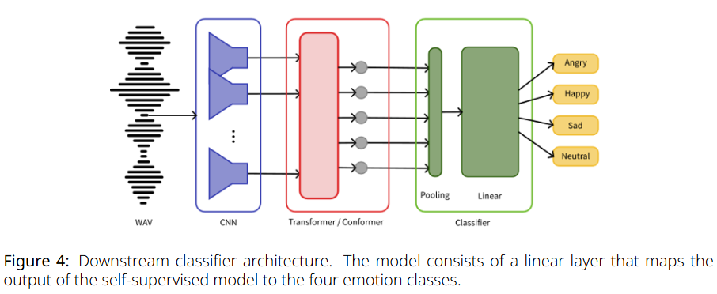
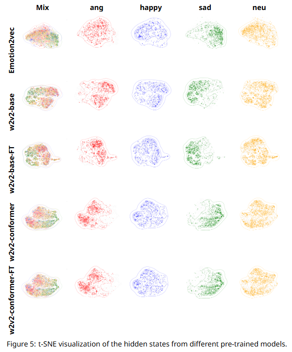
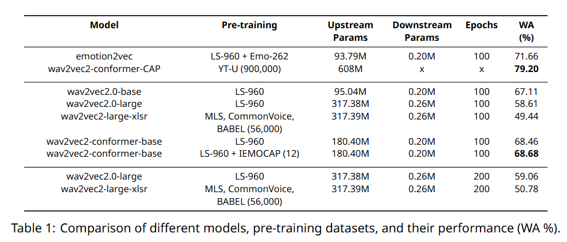

# Emotion-Conformer

## Model checkpoint (Hugging Face)
[poyu39/wav2vec2-conformer-base-librispeech](https://huggingface.co/poyu39/wav2vec2-conformer-base_librispeech)

## Abstract
In this experiment report, we introduce the task of speech emotion recognition. We refer to some of the best-performing self-supervised models in speech-related tasks, such as [Emotion2vec](https://arxiv.org/abs/2312.15185), [Wav2vec2.0](https://arxiv.org/abs/2006.11477), [Conformer](https://arxiv.org/abs/2005.08100) and [Wav2vec2-Conformer](https://arxiv.org/abs/2110.04621). These models use a simple downstream linear classifier to categorize four emotions: angry, happy, sad, and neutral. The training process is divided into two stages: the first stage is upstream pre-training using the self-supervised models, and the second stage is training the downstream classifier. The experimental results show that these self-supervised models perform well in speech emotion recognition tasks, especially the large-parameter Wav2vec2.0-Conformer model, which achieved the highest accuracy after fine-tuning.

## Downstream Classifier
The downstream classifier consists of two simple fully connected layers. The first layer reduces the input feature dimension from 768 to 256, and the second layer further reduces it to 4, corresponding to the four emotion categories. Each layer is followed by a ReLU activation function. Finally, a Softmax function is applied to output the probability distribution for each emotion category. During training, Cross Entropy Loss is used to measure the difference between the predictions and true labels, and the Adam optimizer is used to update the model parameters.

    

## Results

    

    

